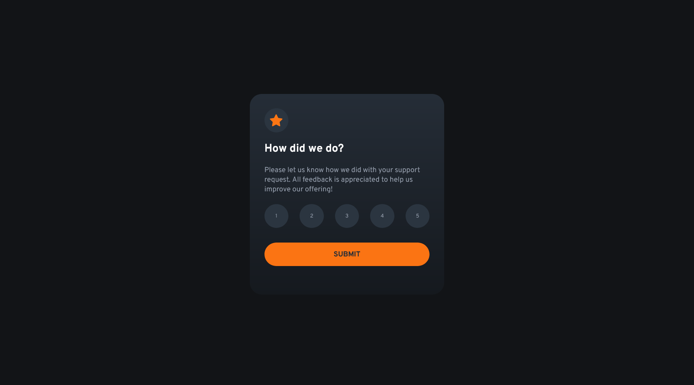

# Frontend Mentor - Interactive rating component solution

This is a solution to the [Interactive rating component challenge on Frontend Mentor](https://www.frontendmentor.io/challenges/interactive-rating-component-koxpeBUmI). Frontend Mentor challenges help you improve your coding skills by building realistic projects. 

## Table of contents

- [Overview](#overview)
  - [Screenshot](#screenshot)
  - [Links](#links)
- [My process](#my-process)
  - [Built with](#built-with)
  - [What I learned](#what-i-learned)
  - [Continued development](#continued-development)
  - [Useful resources](#useful-resources)
- [Author](#author)
- [Acknowledgments](#acknowledgments)

## Overview

### Screenshot




### Links

- Solution URL: [Solution here](https://github.com/MariaCMontO/rating-component-cmo)

## My process

### Built with

- Semantic HTML5 markup
- CSS custom properties
- Flexbox
- Grid
- JavaScript

### What I learned

With this project, I learned how to include accesibily. It's important to include atributes like aria-label, aria-pressed in elements like buttons to make it clear to all people. Other thing is about titles, in each article add an aria-labelledby with the id of its title.

```html
<button type="button" role="radio" aria-pressed="false" aria-label="Rate 5 out of 5">5</button>

<article id="response-container" class="is-hidden" aria-labelledby="Thank-you-title" >
<h2 id="thank-you-title">Thank you!</h2>
```

### Continued development

I definitely want to keep developing interfaces with JavaScript functions, in order to make them more interactive.

### Useful resources

## Author

- Frontend Mentor - [@MariaCMontO](https://github.com/MariaCMontO)


## Acknowledgments
